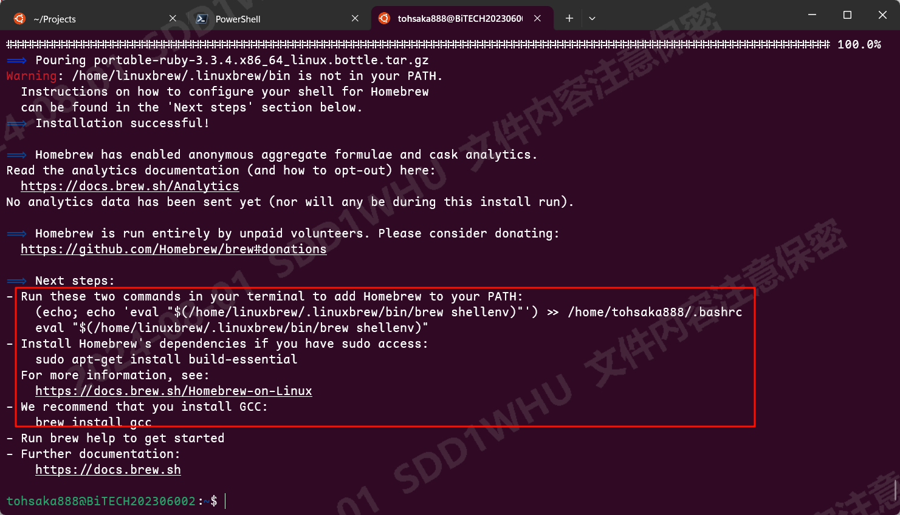

# Linux_Env_Setup

本指南针对 [`WSL` 设计](https://github.com/microsoft/WSL)，理论上适用所有Linux发行版。如有冲突请自行Google解决。

## 包管理器

对于不同的Linux发行版有不同的包管理器，对于`Debian`和`Ubuntu`，大多使用`apt`。对于`Arch`和`Manjaro`，大多使用`pacman`。

有没有什么可以统一发行版的包管理器呢？

有，他就是 [`Homebrew`](https://brew.sh/)

### 安装Homebrew

运行如下命令：

```bash
/bin/bash -c "$(curl -fsSL https://raw.githubusercontent.com/Homebrew/install/HEAD/install.sh)"
```

出现如下信息时代表安装成功：



接下来，按照下一步指引配置环境变量：

```bash
(echo; echo 'eval "$(/home/linuxbrew/.linuxbrew/bin/brew shellenv)"') >> ~/.bashrc
eval "$(/home/linuxbrew/.linuxbrew/bin/brew shellenv)"
```

运行完之后加载`bash`配置：

```bash
source ~/.bashrc
```

运行如下命令查看是否运行成功。

```bash
brew doctor
```

显示如下则配置OK：

```bash
$ brew doctor
Please note that these warnings are just used to help the Homebrew maintainers
with debugging if you file an issue. If everything you use Homebrew for is
working fine: please don't worry or file an issue; just ignore this. Thanks!

Warning: No developer tools installed.
Install Clang or run `brew install gcc`.
```

## Shell

对于 `Shell` 的选择有很多，近些年越来越多的高级Shell频出，例如：[Fish](https://fishshell.com/)和[NuShell](https://www.nushell.sh/)，但是他们大多都不支持原生Shell脚本，会极大的抬高适用门槛。

> 个人使用过一段时间的NuShell，真的很爽，但是语法差异过大导致很多脚本无法使用。

因此，本文档推荐使用 `Zsh`，它兼容 `Bash`，并且拥有丰富的插件和主题，可以满足大部分需求。

### 安装Zsh

```bash
brew install zsh
```

在终端输入如下命令切换shell：

```bash
zsh
```

### 配置默认shell

运行如下命令切换默认shell为zsh：

```bash
command -v zsh | sudo tee -a /etc/shells
sudo chsh -s "$(command -v zsh)" "${USER}"
```

### 安装zsh4humans

zsh中许多增强插件，例如：oh-my-zsh，但基本都需要复杂的配置。

[zsh4humans](https://github.com/romkatv/zsh4humans)是一个聚合了各种常见插件和配置的仓库。虽然最近维护并不是很及时，但并不妨碍它的优势。

运行如下命令安装：

```bash
if command -v curl >/dev/null 2>&1; then
  sh -c "$(curl -fsSL https://raw.githubusercontent.com/romkatv/zsh4humans/v5/install)"
else
  sh -c "$(wget -O- https://raw.githubusercontent.com/romkatv/zsh4humans/v5/install)"
fi
```

按照配置项完成配置，就会得到一个包含各种高级功能的shell。


具体功能包括：
1. 命令高亮
2. 命令提示
3. 命令补全
4. 命令历史
5. 命令别名
6. 文件路径补全
7. 文件名补全
...

